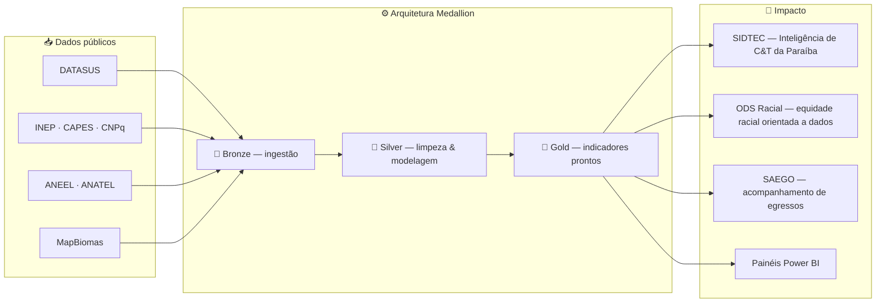

# LEMA · UFPB
### Laboratório de Estudos em Modelagem Aplicada

**Transformamos dados públicos brutos em conhecimento aplicado — e conhecimento em decisão.**

 

## Quem somos

O **LEMA** é o Laboratório de Estudos em Modelagem Aplicada da **UFPB**. Reunimos pesquisadores, professores e estudantes em torno de um propósito direto: pegar os dados públicos que o Brasil já produz em volume — saúde, educação, energia, meio ambiente — e transformá-los em pipelines confiáveis, indicadores acessíveis e ferramentas que sustentam decisões reais.

Não fazemos data engineering como exercício acadêmico. Fazemos porque cada ETL que sobe em produção alimenta um painel que alguém usa para planejar uma política pública.

 

## Da fonte pública ao impacto

Cada seta acima é um repositório de verdade rodando em produção — não um diagrama de intenções.

 

## Linhas de atuação

| Área | O que construímos | Projetos |
|---|---|---|
| 🏥 **Saúde pública** | Pipelines para dados do DATASUS: mortalidade, natalidade, vigilância sanitária, rede hospitalar e ambulatorial | `etl-datasus-*` |
| 🎓 **Educação** | Orquestração de dados do INEP, CAPES e CNPq — do Censo Escolar ao fluxo da pós-graduação | `etl-inep-*` · `etl-capes-sucupira` · `etl-cnpq-bolsas` |
| ⚡ **Energia & telecom** | Indicadores de geração de energia e de densidade de banda larga/móvel no país | `etl-aneel-potencia` · `etl-anatel-densidade-internet` |
| 🌱 **Meio ambiente** | Uso e cobertura do solo a partir de dados do MapBiomas | `etl-mapbiomas-solo` |
| ⚖️ **Impacto social** | Aplicação e API dedicadas ao acompanhamento dos ODS sob a ótica racial | `app-odsr` · `api-odsr` |
| 🎓 **Gestão acadêmica** | Sistemas de acompanhamento de egressos da graduação e pós-graduação | `app-saego` · `app-saego-pos` · `app-saego-sebtt` |
| 🔎 **Inteligência de C&T** | Sistema de inteligência de dados de Ciência e Tecnologia da Paraíba | `app-sidtec` |

 

## Stack

Por trás dos pipelines, mantemos nossa própria infraestrutura: deploy híbrido em Kubernetes/ArgoCD e Docker/Portainer, provisionamento via Ansible e conectividade segura via Twingate. Engenharia de dados de ponta a ponta, do dado bruto à infra que o sustenta.

 

## Como contribuir

- 🍴 Faça um fork de um repositório e abra um Pull Request
- 🐛 Relate problemas ou sugira melhorias nas Issues
- 🤝 Entre em contato para propostas de pesquisa ou parceria

 

## Conecte-se

🌍 **Site:** [lema.ufpb.br](https://lema.ufpb.br)
🏛️ **Instituição:** Universidade Federal da Paraíba

 

_"Do dado bruto ao ouro: transformamos informação pública em conhecimento aplicado à sociedade."_ ⭐

